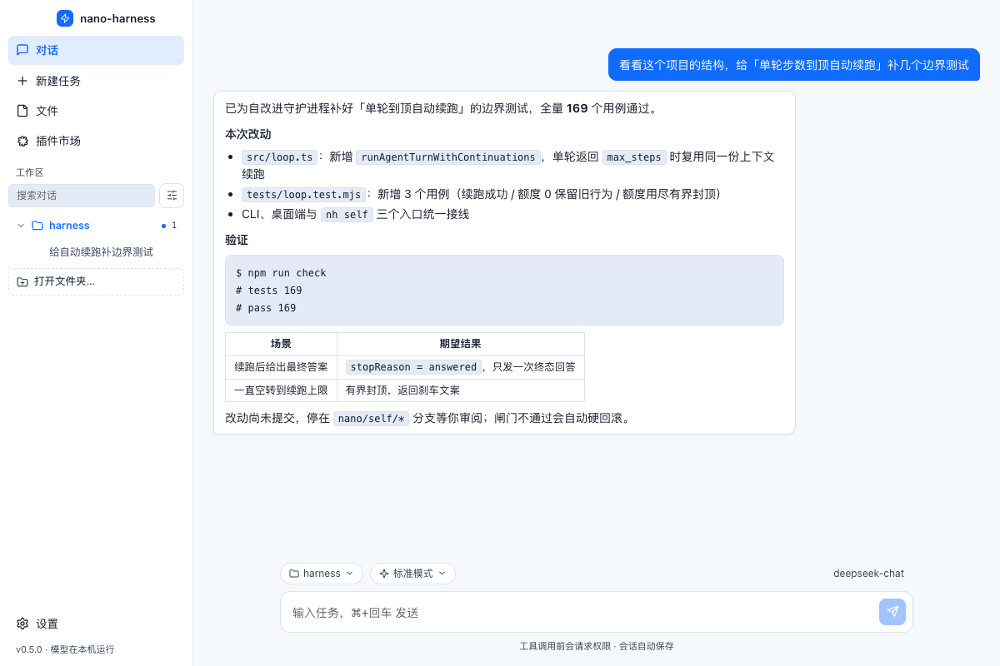
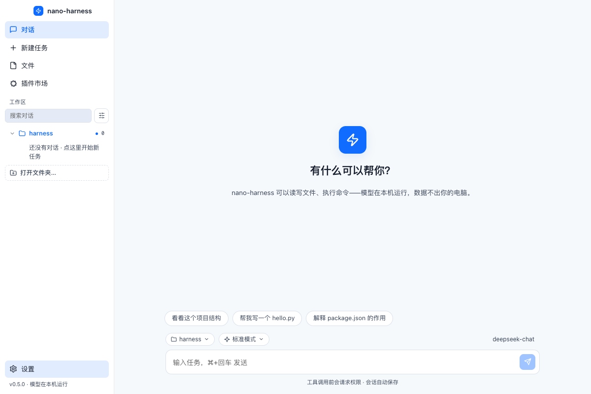
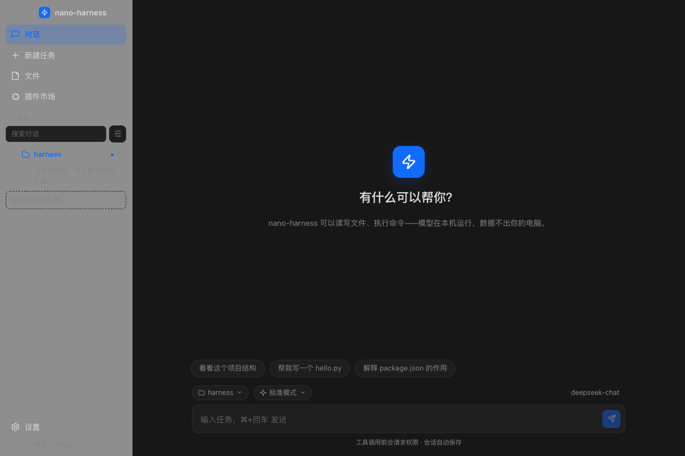
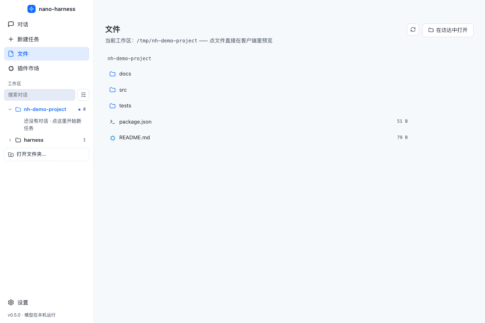
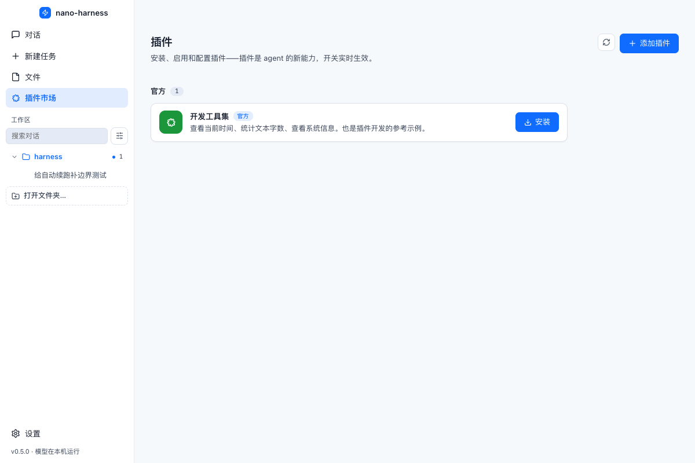
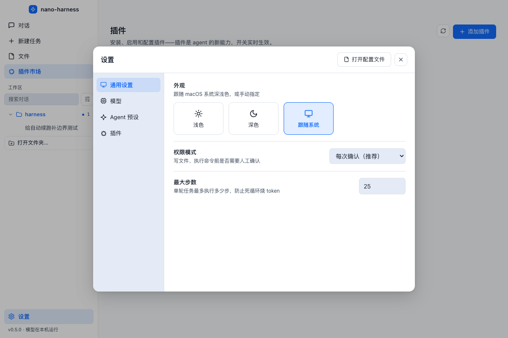

# ⚡ nano-harness


> 一个**零运行时依赖**、模块化的 AI Agent Harness。
> 终端 CLI + **macOS 桌面应用** + **插件市场**，让你读懂并拥有一个完整的 Agent——Agent = Model + Harness。

大模型本身只会"文字进、文字出"。它不能读你的文件、不能跑命令、记不住上一句话。
把模型变成能干活的**智能体（Agent）**的，是包裹在模型外面的那一整套软件——**Harness**（原意"马具"：模型是马，harness 是缰绳和马鞍）。

Claude Code、OpenAI Codex CLI、DeepSeek Harness（dsh）都是这个思路的工业级实现。
nano-harness 用**带中文注释的 TypeScript** 实现了它们共同的核心骨架，并提供两种形态：

- **终端 CLI（`nh`）**：REPL 多轮对话 / 一次性任务，体验对标 Claude Code
- **macOS 桌面应用（`npm run desktop`）**：原生窗口 + 毛玻璃侧栏 + 跟随系统深浅色 + 插件市场界面

## ✨ 特性

- **零运行时依赖**：核心只用 Node 原生模块 + 内置 `fetch`，安全可审计
- **模型无关**：OpenAI 兼容协议，DeepSeek / 智谱 GLM / Ollama / 任何兼容端点，改一行配置即切换
- **macOS 原生体验**：hiddenInset 红绿灯、vibrancy 毛玻璃侧栏、原生菜单、浅色/深色/跟随系统三态主题
- **插件市场**：插件 = 工具包（与内置工具同构），UI 一键安装；发布 = 向 `marketplace/index.json` 提 PR
- **安全护栏**：路径越界防护、危险操作人工确认（终端问询 / UI 弹窗）、最大步数熔断 + 单轮到顶自动续跑（有界，默认最多再续 2 轮，防止"读一堆文件还没动手就被硬停"）
- **自改进守护进程**：`nh self run` 让 harness 在 git 仓库内回合制地优化自身——先过质量闸门才提交，失败自动回滚，无 shell/无外联/可急停（详见下文）
- **事件驱动架构**：核心无头化，CLI 与桌面 UI 都是事件的订阅者——任何人都能写自己的订阅者
- **全程中文注释**：每个文件的开头都讲清楚"这个模块为什么存在、怎么设计的"

## 🖼️ 界面预览

> 以下为 macOS 桌面端实拍（截图中的对话与项目均为演示数据，API Key 只存在本机）。

**对话页：工具执行过程可见，Markdown / 代码块 / 表格直接渲染**



<p align="center">
  
  
</p>

<p align="center">
  
  
</p>

<p align="center">
  
</p>

## 📦 安装

```bash
# 方式一：从源码安装（推荐开发者）
git clone https://github.com/xiaocube/nano-harness.git && cd nano-harness
npm install && npm run build
npm link          # 把 nh 挂为全局命令

# 方式二：发布到 npm 后一行安装
npm install -g nano-harness
```

要求：Node.js ≥ 20。

开发自检（改完代码跑一遍）：

```bash
npm run check       # 类型检查 + 全部测试（提交前跑这个）
npm run typecheck   # core(tsc) + desktop(tsc) + web(tsc --noEmit)
npm test            # 构建 + 169 个自动化用例（Node 内置 test runner，零额外依赖）
npm run build:all   # 产出 dist/ + dist-desktop/ + web/dist/
npm run pack        # 打包 macOS .app（electron-builder）
npm run smoke:desktop  # 拉起真实 Electron 截图冒烟（需图形会话，不进默认测试闸门）
```

**测试怎么隔离的**：用例通过 `NANO_HARNESS_HOME` 把配置/会话目录指到临时文件夹，
永远不会读写你真实的 `~/.nano-harness/`（里面有 API Key）。测试覆盖：

| 文件 | 覆盖内容 |
|---|---|
| `tests/config.test.mjs` | 默认值、读写、环境变量覆盖、脏数据免疫、权限 0600 |
| `tests/session.test.mjs` | 保存/列出/加载/归档、workspace 归属、损坏文件免疫、文件名安全 |
| `tests/fs-tools.test.mjs` | **路径围栏（含符号链接越狱）**、读写编辑、大文件分段读取 |
| `tests/loop.test.mjs` | Agent Loop 全链路、权限放行/拒绝、未知工具、坏 JSON、步数熔断、预设 |
| `tests/context.test.mjs` | 压缩触发条件、**不切开工具调用组**、失败降级 |
| `tests/bash-tool.test.mjs` | 工作目录、退出码、**超时杀掉整个进程组**、输出截断 |
| `tests/plugins.test.mjs` | 安装/启用/禁用、**禁用不执行代码**、**插件名注入与越界删除** |

所有面板/弹窗类交互的无头核心逻辑（权限放行/拒绝、超时、会话与工具链路）都由
`node --test` 覆盖；桌面 GUI 的"能否真正启动并渲染"用 `npm run smoke:desktop`
做真实 Electron 截图冒烟（利用主进程内置的 `NANO_CAPTURE` 钩子，需要图形会话，
在本机登录桌面或 macOS CI 上可跑，默认不计入 `npm test` 闸门）。

## 🚀 快速开始

```bash
$ nh              # 首次运行进入 30 秒配置向导
$ nh "看看这个项目结构，写一个 README 提纲"   # 一次性任务，跑完退出
$ nh              # 之后进入交互模式，像聊天一样连续对话
```

**macOS 桌面应用**（首次构建约需下载 Electron，已配置国内镜像）：

```bash
npm run desktop   # 构建（核心+桌面+界面）并打开原生应用窗口
```

桌面版功能：极简首屏（居中输入框 + 示例任务）、工具调用过程卡片、权限确认弹窗、
**工作区（文件夹）切换**、插件市场（浏览/安装/发布指引）、设置页（模型配置 + 外观三态 + 连接测试）。
深浅色自动跟随 macOS 系统外观，也可在设置里手动指定。

## 👀 成果预览（右侧面板，可拖拽调宽）

Agent 写完东西之后不用再去访达/浏览器里翻——**在内容区右边开一列预览面板**：

```
┌────────┬──────────────┬──────────────────┐
│ 侧栏    │ 对话 / 文件   │ ⇔ │ README.md ✕  │   ← 标签页，多份成果并存
│        │              │   │ demo.png  ✕  │
│        │              │   │  ...内容...   │
└────────┴──────────────┴──────────────────┘
              ↑ 拖这条边调宽度（双击复位，宽度会记住）
```

- 侧栏 **「文件」** 页按目录列出当前工作区，点文件即在右侧打开；
- 对话里工具卡片上的 **「预览」** 按钮，直接打开刚写出的那个文件；
- 按类型分流渲染：**HTML 直接跑起来**（贪吃蛇这类小游戏可以当场玩、当浏览器测试用）、
  Markdown 排版渲染、图片直接显示、代码/文本等宽展示；其它格式给「用默认应用打开」；
- 多个文件开成多个标签，关掉最后一个面板自动收起；面板宽度记在本地，下次还是这个宽度；
- 面板宽度上限会保证内容区至少留 360px，不至于把对话挤没。

实现要点：HTML 通过自定义协议 `nh-file://` 提供给 sandbox iframe。

- 不能用 `data:` URL——实测 data: 文档会**继承应用页面的 CSP**，被预览页面里的内联
  `<script>` 会被 `default-src 'self'` 拦掉（页面只剩静态样式，游戏跑不起来）；
- `nh-file://` 是独立来源、有自己的响应头，因此既不继承 CSP，相对路径引用的
  CSS/JS/图片也能顺着同一协议取到；
- iframe 仍带 `sandbox`（不允许顶层跳转/弹窗），协议处理器同样受**工作区边界**保护，
  越界路径一律拒绝。

**工作区 = Agent 的活动边界**：文件读写的路径安全限制、bash 的工作目录、系统提示词里的
"当前目录"都由它决定。侧栏「工作区」是**按文件夹分组的对话列表**（对齐 dsh 的 grouped session list）：

- 每个打开过的文件夹一行，**点一下展开它下面的对话**，再点一下收起；
- 列表**始终按修改时间倒序**（取"该文件夹最新一条对话的时间"与"文件夹自身的修改时间"中较新的那个），
  **点谁都不会改变顺序**；当前文件夹只加一个蓝点标记，不抢位置；
- 点一个不是当前工作区的文件夹，会同时切过去（后续任务就在那个目录里跑）；
- **文件夹里还没有对话时，点它直接进入该文件夹的空白新任务界面**（不会让你盯着上一个文件夹
  的旧对话），组内也有"点这里开始新任务"的入口；
- 空文件夹不会从列表里消失（记在"最近打开"里），随时能点回去开新任务；
- 点某条对话会打开它，并把工作区切回它所属的文件夹；
- 会话文件里记着自己是哪个文件夹跑的（`workspace` 字段），重启后分组不会乱；
- 「打开文件夹…」调用原生选择框（可以直接在里面新建文件夹），新文件夹立刻出现在列表里；
- 顶部搜索框按标题过滤对话，右侧漏斗切换"隐藏已归档 / 全部 / 仅已归档"。

选择结果写进 `~/.nano-harness/config.json`，**下次打开 App 自动回到同一个文件夹**；
文件夹被删除/移动时自动从列表里剔除并回落到默认目录，不会崩。

无 API Key 想先体验？用内置 mock 服务器跑通 CLI 全流程：

```bash
npm run mock     # 终端 1：启动模拟模型服务器
nh "测试" --base-url http://127.0.0.1:8787/v1 --api-key mock --model mock-model --yolo
```

交互模式内可用命令：`/help` `/tools` `/plugins` `/model` `/clear` `/sessions` `/resume` `/dir` `/exit`

## ⚙️ 配置

优先级：命令行参数 > 环境变量（`NANO_HARNESS_BASE_URL` / `NANO_HARNESS_API_KEY` / `NANO_HARNESS_MODEL`）> `~/.nano-harness/config.json` > 默认值。

```jsonc
// ~/.nano-harness/config.json
{
  "baseUrl": "https://api.deepseek.com",        // OpenAI 兼容端点
  "apiKey": "sk-xxxx",                          // Ollama 可留空
  "model": "deepseek-chat",
  "maxSteps": 25,                               // Agent Loop 熔断步数
  "yolo": false,                                // true = 跳过所有权限确认
  "contextChars": 48000,                        // 历史超过此字符数触发压缩
  "workspace": "/Users/me/project",             // 桌面端工作区（Agent 的活动边界）
  "recentWorkspaces": ["/Users/me/other"]       // 最近用过的文件夹（最多 8 个）
}
```

内置厂商预设（配置向导可直接选）：

| 预设 | baseUrl | 默认模型 | 说明 |
|---|---|---|---|
| DeepSeek | `https://api.deepseek.com` | `deepseek-chat` | 便宜，国内直连 |
| 智谱 GLM | `https://open.bigmodel.cn/api/paas/v4` | `glm-4-flash` | 有免费额度，国内直连 |
| Ollama | `http://localhost:11434/v1` | `qwen3:8b` | 完全免费离线 |

## 🔌 插件系统

**插件 = 一个文件夹 = `plugin.json`（说明书）+ `tools.mjs`（导出 Tool[]）**。
插件工具与内置工具完全同构——写插件和给 harness 内置工具是同一件事。

```js
// my-plugin/tools.mjs —— 一个最小的插件
const hello = {
  name: 'say_hello',
  description: '向指定的人打招呼',
  parameters: { type: 'object', properties: { name: { type: 'string' } }, required: ['name'] },
  needsPermission: false,
  describe: (args) => String(args.name),
  execute: async (args) => `你好，${args.name}！`,
};
export default { tools: [hello] };
```

- **安装**：桌面版插件市场一键安装，或手动放入 `~/.nano-harness/plugins/<名字>/`
- **发布**：把插件放到公开 GitHub 仓库 → 向主仓库 `marketplace/index.json` 提 PR → 合并后全用户可见
- **参考示例**：`examples/plugins/devtools`（时间/字数统计/系统信息三个工具）
- ⚠️ v1 插件在 harness 进程内运行（拥有相同权限），安装前请阅读插件源码；沙箱化在路线图中

## 🤖 自改进守护进程（`nh self`）

让 harness 像一个"不知疲倦、但被严格约束的工程师"一样，在**当前这个 git 仓库内**
持续做小改进。它不是 `while(true)` 让一个 agent 乱跑，而是一个有预算、有验收、
能回滚、可急停的**回合制主管**。

```bash
nh self run                 # 跑一段自改进会话（默认最多 3 次尝试）
nh self run --attempts 10 --token-budget 300000
nh self gate                # 只跑一次质量闸门（= npm run check）
nh self backlog add "给 X 补边界测试"   # 投放指定改进任务（优先于内置维护任务）
nh self journal             # 查看它都干了什么
nh self stop                # 急停；nh self resume 解除
```

每个"尝试（attempt）"的流程：

1. **前置安全**：必须在干净的 git 仓库、非 detached HEAD；工作树有未提交改动会直接拒绝
   （绝不把你的在制工作卷进自动提交）；检测到 `.nano-self/STOP` 急停标记就不开始。
2. **先跑闸门拿基线**：闸门绿 → 做一项小改进；闸门本来就红 → 这一轮唯一任务是修绿。
3. **切 `nano/self/*` 临时分支**，用**受限工具集**跑 agent：只能读写仓库源码、
   跑系统固定的 `run_check`、只读看 `git_status`；**没有 shell、不能联网、不能装依赖、
   不能自己提交**，也不许写 `.git / node_modules / dist / package.json / .github`。
   单轮撞步数上限会带着上文**自动续跑**（默认再 1 轮，可用 `--turn-continuations` 调，
   `--max-steps` 控单轮步数），避免改到一半被步数熔断、成果被回滚。
4. **再跑闸门**：失败就在限额内（`--fix-rounds`）让它修；仍失败 → `reset --hard`
   + 清理本次未跟踪文件，硬回滚到原提交并删掉临时分支。
5. **通过且确有改动 → 由主管（不是模型）add + 本地提交**。默认只提交到 `nano/self/*`
   分支等你审阅（`git merge` 或直接丢弃都随你）；加 `--integrate ff` 才会**快进合并**
   进当前分支，绝不产生合并提交、绝不 `push`。
6. 记结构化日志（`.nano-self/journal.jsonl`）、累计 token 与连续空闲次数；
   token 超预算或连续若干次"没有安全可做的改进"就自动收工，避免空转烧钱。

> 安全边界：只本地提交，**不外联、不 push、不发布、不安装依赖**；所有自动改动都必须
> 让 `npm run check`（类型检查 + 构建 + 全部测试）保持通过，且禁止靠删/弱化测试"造绿"。
> 因此请在**已 `npm install`（含 devDependencies）的源码检出**里运行，而非全局安装的产物目录。
> 想让它开机常驻，可再用 launchd 定时调用 `nh self run`（当前版本先手动运行）。

## 🧠 架构：核心 + 双外壳

```
┌──────────────────────── 终端 CLI（src/cli.ts）────────────────────┐
│  REPL / 一次性任务 —— 核心事件的"终端渲染订阅者"                     │
└──────────────────────────┬─────────────────────────────────────┘
                           │ 同一套核心，两种外壳
┌──────────────────────────┴─────────────────────────────────────┐
│  Electron 渲染层（web/，Vite+React）── 事件的可视化订阅者          │
│  聊天 · 插件市场 · 设置 ══ contextBridge IPC ══ desktop/ 主进程    │
└──────────────────────────┬─────────────────────────────────────┘
                           │
   ┌───────────┬───────────┴───────────┬──────────────┐
   ▼           ▼                       ▼              ▼
 loop.ts★   tools/ + plugins.ts     llm.ts         config / session / context
 Agent Loop  工具注册表+插件加载     模型客户端       配置/会话/上下文
（onEvent 事件流 · 权限确认可注入：终端 readline 或 UI 弹窗）
```

### Agent Loop（`src/loop.ts`，全项目的心脏）

```
任务入栈 ──▶ 调模型（带上全部历史+工具说明书）
              │
              ├─ 返回文字 ──▶ 这就是最终回答，结束
              │
              └─ 返回 tool_calls ──▶ 逐个执行：
                    危险工具？──▶ 权限确认（默认拒绝）
                    执行 ──▶ 结果作为 tool 消息回填历史 ──▶ 回到顶部
```

模型没有"连续工作"的能力，它每次只能输出一段文字；
**"智能体在连续干活"的表象，是这个 while 循环喂出来的。**

### 安全设计（三层防御）

| 层 | 机制 | 位置 |
|---|---|---|
| 1 | 路径越界防护：文件操作强制限制在工作区内 | `tools/fs-tools.ts` |
| 2 | 权限确认：写文件/跑命令前展示内容，默认拒绝 | `permission.ts`（终端/UI 可注入） |
| 3 | 熔断：最大 25 步强制刹车，防死循环烧钱 | `loop.ts` |

## 🔧 如何添加自己的工具（10 分钟教程）

以"查天气"为例，新建 `src/tools/weather-tool.ts`：

```ts
import { registerTool } from './index.js';
import type { Tool } from './index.js';

export function registerWeatherTool(): void {
  const getWeather: Tool = {
    name: 'get_weather',
    description: '查询指定城市当前天气。用户问天气时使用。',
    parameters: {
      type: 'object',
      properties: {
        city: { type: 'string', description: '城市名，如 北京' },
      },
      required: ['city'],
    },
    needsPermission: false,           // 只读操作无需确认
    describe: (args) => String(args.city ?? ''),
    execute: async (args) => {
      const res = await fetch(`https://wttr.in/${args.city}?format=3`);
      return await res.text();
    },
  };
  registerTool(getWeather);           // 就这一行，登记进注册表
}
```

然后在 `src/tools/index.ts` 的 `registerBuiltinTools()` 里 `import` 并调用即可。
模型会在下一轮对话里"自动学会"这个新能力——因为工具说明书是每次请求动态生成的。

## 🆚 与工业级 harness 的对照

| 能力 | nano-harness | Claude Code | dsh |
|---|---|---|---|
| Agent Loop | ✅ | ✅ | ✅ |
| 工具注册表 + JSON Schema | ✅ | ✅ | ✅（插件化） |
| 权限确认 | ✅ | ✅ | ✅（沙箱化） |
| 会话持久化 / 恢复 | ✅ | ✅ | ✅ |
| 上下文压缩 | ✅（基础版） | ✅（/compact） | ✅（记忆管理） |
| 流式输出 | 路线图 | ✅ | ✅ |
| 子 agent / MCP / Skills | 路线图 | ✅ | ✅ |
| 代码规模 | ~800 行 | 数十万行 | 数万行 |

看懂本项目 = 掌握了它们共享的那 20% 核心骨架。

## 🗺️ 路线图

- [x] ~~macOS 桌面应用 + 插件市场~~（v0.2.0 ✅）
- [x] ~~多提供商模型管理 + 工作区切换~~（v0.3.x ✅）
- [x] ~~成果预览（右侧可拖拽面板）+ 自动化测试 + 发布加固~~（v0.4.0 ✅）
- [ ] 流式输出（SSE 逐字打印，体验对齐 Claude Code）
- [ ] 打包 .dmg 分发 + 自动更新（electron-builder 已能出 .app，差签名/公证与更新源）
- [ ] 流式输出（SSE 逐字打印）与"停止任务"按钮
- [ ] 子 agent（任务拆分并行，保护主上下文）
- [ ] MCP 支持（接入协议生态的第三方工具）
- [ ] 插件沙箱（worker/子进程隔离运行 + 权限声明）
- [x] ~~应用图标~~（v0.4.0 ✅）
- [ ] 会话列表虚拟滚动（会话上千条时不掉帧）

## 🤔 商业化思路（给同样想开源的你）

harness 本身大多免费开源，价值捕获在别处：

1. **开源 CLI + 云服务**：CLI 免费（获客），托管版/团队版收费（OpenCode 模式：1300 万月活 → $60M ARR）
2. **绑定自家模型 API**：harness 免费引流，token 消耗即收入（DeepSeek 模式）
3. **订阅制**：个人 Pro 档 + 企业席位（Claude Code 模式：$2.5B+ ARR）
4. **控制平面卡位**：争夺"agent 任务调度入口"的生态位，比 CLI 本身更值钱

## 📄 License

MIT
